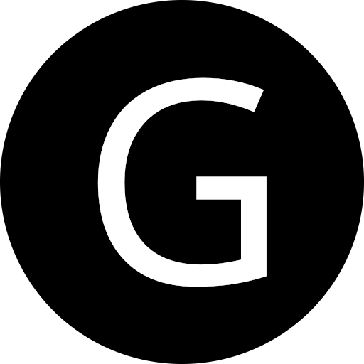

    

    

# gastonrivata.com
Gastón's personal website created be the necessity of having something to justify learning Gatsby, GraphQL, and having some place to keep writings.
Running on Gatsby, React and Node.js.
For now I'm keeping Gatsby's G because can be my G also :P.

## Notes
I've doing this blog/project for curiosity, exploration, as binnacle and for having some place to try new things. I'm working in this project motivated for [Tania's blog](https://www.taniarascia.com/) and following what she did as first step and then, hopefully, developing my own style.
I'm starting with most of the needed things set thanks to [Gatsby Advanced Starter](https://github.com/vagr9k/gatsby-advanced-starter/)

## Acknoledgements
- Tania Rascia - [Tania's Blog](https://www.taniarascia.com/)
- Ruben Harutyunyan - [Gatsby Advanced Starter](https://github.com/vagr9k/gatsby-advanced-starter/)

## Author
Gastón Rivata (Soon, hopefully, here will be the blog :))

## License
This project is open source and available under the [MIT License](LICENSE).